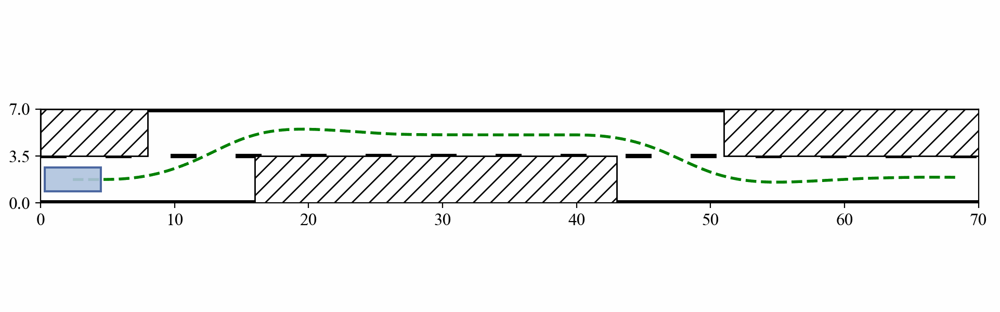
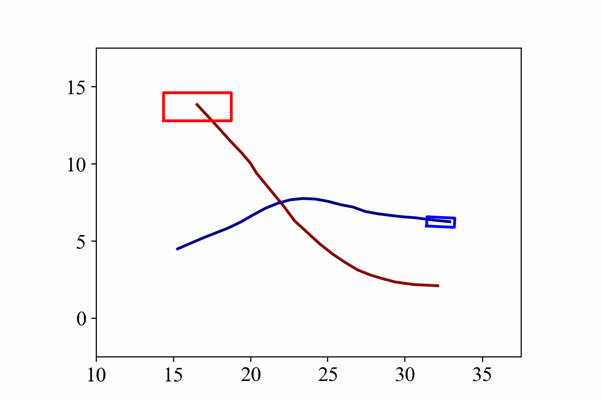

# Voronoi-Mixed-Traffic-Simulation

Unified microscopic simulation of heterogeneous mixed traffic (pedestrians, bicycles, vehicles) using Voronoi-based spatial deconstruction. Python implementation of the model proposed in our paper. #mixed-traffic #pedestrian-simulation #voronoi-diagram #traffic-modeling #microscopic-simulation

---

## Project Overview

This repository presents the Python implementation of a novel microscopic simulation model designed for heterogeneous mixed traffic, encompassing pedestrians, bicycles, and vehicles. Our approach leverages a **Voronoi-based spatial deconstruction method** to unify the diverse entities by mapping their physical interactions into a shared topological space. This framework progresses from dynamic spatial perception to heuristic decision-making and generalized kinematic execution.

The model offers a robust, theoretically grounded, and computationally feasible tool for mixed traffic analysis, holding significant potential for establishing high-fidelity virtual environments for autonomous vehicle (AV) testing. It excels at simulating autonomous, heterogeneous, and responsive background traffic participants (Non-Ego entities), providing a dynamic and interactive environment for AV evaluation.

## Key Features

*   **Unified Cognition Framework:** Utilizes Generalized Voronoi Diagrams (GVD) to dynamically partition continuous space, enabling heterogeneous entities (polygons for vehicles/bicycles, circles for pedestrians) to perceive and interact with immediate topological neighbors, overcoming limitations of fixed metric sensing ranges.
*   **Generalized Kinematic Model (2-DOF):** Employs a unified 2-Degrees-of-Freedom kinematic model across all entity types, abstracting pedestrian agility through optimized virtual parameters while accurately representing vehicle and bicycle dynamics.
*   **Safety-Oriented Heuristic Rules:** Employs a sequential decision-making logic ("first select steering angle, then select speed") driven by a safety-efficiency trade-off, incorporating dynamic Time-to-Collision (TTC) and time headway (Ts) for realistic collision avoidance and yielding behaviors.
*   **Reproduces Emergent Phenomena:** Capable of reproducing complex self-organizing phenomena such as lane formation, bottleneck effects, and traffic wave propagation.

## Simulation Demonstrations

These dynamic demonstrations highlight the model's ability to generate realistic, reactive background traffic, showcasing its potential for creating high-fidelity virtual environments for autonomous vehicle testing.

### 1. Lane Formation of Bidirectional Pedestrian Flow

This simulation illustrates the self-organizing phenomenon where an initially mixed flow of pedestrians with opposing destinations spontaneously separates into distinct, unidirectional lanes. This emergent behavior is a key indicator of realistic pedestrian dynamics (see **Section 4.2** in our paper).

   
   

### 2. High-Density Pedestrian Evacuation (Bottleneck Effect)

This scenario demonstrates the model's performance under extreme density conditions, such as pedestrian evacuation through a narrow bottleneck. It accurately reproduces the classic "arching effect" and complex lateral avoidance behaviors observed in real-world experiments (detailed in **Appendix D** of our paper).

### 3. Vehicle Obstacle Avoidance (Double Lane Change Maneuver)

This demonstration showcases a self-navigating vehicle performing a double lane change maneuver to avoid fixed obstacles. It validates the model's capability to generate kinematically realistic and collision-free vehicle trajectories in constrained environments (as discussed in **Section 4.3** of our paper).

### 4. Heterogeneous Interactions at Intersections

This complex scenario highlights dynamic interactions between vehicles and pedestrians at an intersection. The model accurately captures heterogeneous negotiation behaviors, such as vehicles yielding to pedestrians and pedestrians adjusting their paths dynamically, reflecting the model's utility for simulating diverse mixed traffic conditions for AV testing (evaluated in **Sections 5.1 and 5.2** of our paper).

---
